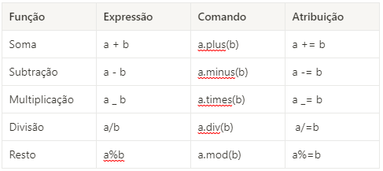
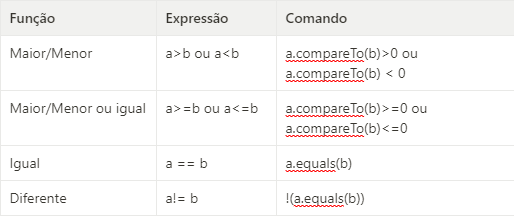
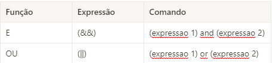

# Kotlin

[◄ back](../README.md)

## Introdução

## Sumário

- [Tipos de variáveis](#tipos-de-variavéis)
- [Operadores Aritméticos](#operadores-aritméticos)
- [Operadores Comparativos](#operadores-comparativos)
- [Operadores Lógicos](#operadores-lógicos)
- [Operadores In e Range](#operadores-in-e-range)
- [Funções](#funções)
- [Funções Empty e Blank](#funções-empty-e-blank)
- [Funções de ordem superior](#funções-de-ordem-superior)
- [Funções single-line](#funções-single-line)
- [Funções/Extensões](#funções/extensões)
- [Estruturas de controle](#estruturas-de-controle)
- [If/else](#if/else)
- [When](#when)
- [Elvis Operator](#elvis-operator)
- [Atribuição usando estruturas de controle](#atribuição-usando-essas-estruturas)
- [Estruturas de repetição](#estruturas-de-repetição)
- [While](#while)
- [Do..While](#dowhile)
- [For](#for)

## Tipos de variáveis

var - variável comum, dado que pode ser modificado ao longo do código e da execução

val - "variável" é imutável, recebe valor mas não pode ser reatribuído ao longo do código

const val - é uma constante que só pode ser acessada, não reconhecida quando declarada em função - é de caráter global - e é atribuído durante a compilação

-> declaração de variável com tipagem explícita e seguida de interrogação indica que a variável pode receber valor nulo

Exemplo:

```
var phrase:String? = null
// a variável pode ser nula ou um String
var idade:Int? = null
// a variável pode ser nula ou um Int
```

## Operadores Aritméticos



## Operadores Comparativos



Obs: os comandos compareTo retornam valores **-1 para menor que**, **0 para igual** e **1 para maior que**, o trecho de código que compara o compareTo a um valor (0 na tabela) faz o comando retornar um boleano.

Obs2.: Operadores e equals retornam booleano

## Operadores Lógicos

-> retornam booleano



## Operadores **In** e **Range**

Função e expressão

- contém (In)
- não contém (!in)
- range/ faixa de valores

Exemplo 1:

```
val numbers = listOf (3,9,0,1,2)
print(12 in numbers)
```

Exemplo 2:

```
	const val MIN_AGE = 16
	const val MAX_AGE = 68
	//main
	fun main(){
		var age (10..100).random()
		println(age)
		println(age in MIN_AGE..MAX_AGE) // os .. são o simbolo para indicar a faixa de valores a ser analisado
	}
```

## Funções

Uma função é definida por `Fun nomeDaFunção(nome:Tipo):TipoRetorno{}`, quando a função for void basta apenas ocultar o TipoRetorno

### Funções Empty e Blank

`isBlank()` e `isEmpty()`

**Empty** se refere a toda a String cujo **tamanho é igual a zero**. **Blank** se refere a uma String cujo o **conteúdo são apenas espaços em branco**.

- Strings vazias estão em branco, logo se isEmpty é verdadeiro, isBlank é verdadeiro também
- Esses métodos são utilizados principalmente em inputs do usuário

### Funções de ordem superior

São funções que não precisam de objeto ou classe para serem chaamdas. Recebem outra função ou lambda por parametro (lambda seria aquelas funções que possuem uma seta e que representam um bloco de função). São úteis para a generaliação de funções e tratamentos de erros, que permite que a função possa ser reutilizada mais facilmente, seja testada e também mais segura.

```
fun main() {

    val z:Int
    // 34 é equivalente ao n1, 90 é equivalente ao n2 e o sum indica a operação que a função vai fazer
	z = calculate(34,90,::sum)

    println(z)

}

fun sum(a1:Int, a2:Int) = a1.plus(a2)

// Nesse caso, os valores que são passados por parâmetro ao chamar a função, vão ser os mesmo executados pela operação
fun calculate(n1:Int, n2:Int, operation:(Int,Int) -> Int): Int{
    val result = operation(n1,n2)
    return result
}
```

### Funções single-line

`Fun nomeDaFuncao(nome:Tipo) = retorno`

Se trata de uma função de uma linha e infere o tipo de retorno

```
private fun getFullname (name: String, lastName: String) = "$name $lastname"
```

### Funções/ extensões

` fun Tipo.nomeDaFuncao()`

Uma função que só pode ser chamada por um tipo específico, como o caso do plus(). O valor pode ser referenciado dentro da função pela palavra **this**

```
 fun String.randomCapitalizedLetter() = this[(0..this.lenght-1).random()].toUpperCase()
```

## Estruturas de controle

- If/ else
- When (o switch case do Kotlin)
- Elvis Operator

### If/else

```
if(expressao){
	//bloco de codigo
}else if (expressao2){
	//bloco de codigo
}else{
	//bloco
}
```

Obs: O if/else é recomendado para quando se tem poucas expressões, mais do que duas ou três condicionais se recomenda o when. Dessa forma, auxilia no controle e melhora o código tornando-o mais legível.

### When

```
when {
	case1 -> {}
	case2 -> {}
	case3 -> {}
	else -> {}
}
```

O else é obrigatório no corpo do when como alternativa (só não é necessário em caso de booleanos já que ele só tem três estados). Aceita Range como case e também aceita operadores.

Exemplo 1 :

```
when {
	a > b -> {}
	a!= b && a > c -> {}
	b == 0 -> {}
	else -> {}
}
```

### Elvis operator

Verifica se uma variável é nula ou não e atribuindo algo em caso de ser.

Exemplo 1:

```
val a:Int? = null
// Define a variável "a" como Int ou null e atribui null a ela

var number = a ?: 0
// diz que numeber recebe a, o ? indica a verificação da nulidade, se a for nulo então number recebe 0, senão number recebe a.
```

Pode ser encadeado, ou seja ter vários elvis operator seguidos

Exemplo 2:

```
var number = a?: b?: 0
// se a não for nulo, number recebe a, se for ele verifica b. Se b for nulo number recebe 0, se não recebe b.
```

### Atribuição usando essas estruturas

O valor atribuido tem que estar na última linha do bloco. As chaves são opcionais se a condicional só fizer atribuição e se tudo couber numa linha deve ser posto em uma linha só.

Exemplo 1:

```
val MaxValue = if (a > b) a else if (a < b) b else b

val minValue = if (a > b ){
	println("b($b) é o menor valor")
	b
}else if (a < b){
	println("a($a) é o menor valor")
	a
} else {
	println("os valores são iguais")
	b
}
```

## Estruturas de repetição

- While
- Do..While
- For
- forEach

Aceita comandos in, range, until, downTo e step

### While

```
While (condicao){
	//bloco de código
}
```

Enquanto a condição for verdadeira, a repetição vai rodar. Por isso é importante que dentro do bloco de código haja algo que retire essa condição do estado verdadeiro.

### Do..while

```
do {
	// bloco de codigo
}while (condicao)
```

O do while funciona da mesma forma que o while só que enquanto o while não vai executar se a condição não for verdadeira, o do while vai executar pelo menos 1 vez e então verificar se a condição é verdadeira para repetir.

### For

Sua estrutura é caracterizada por `for (varIndexadora in/until/downTo faixa de valores/condicional step intervalo)`

- in : conta do valor inicial até o valor final estabelecido;
- until : conta do valor atual até o valor estabelecido menos 1;
- downTo: conta da maneira decrescente;
- step: determina o intervalo da contagem;

<h6> Se não setar o step ele conta de 1 em 1 </h6>

Exemplo 1 :

```
for (i in 0..20 step 2){
	println(i)
}
// esse trecho de código vai contar de 0 a 20 pulando de 2 em 2
```

Exemplo 2 :

```
fun letters(){
	val sArray = "Olha essa string!"
	for (l in sArray){
		println(l.toUpperCase())
	}
}
```

[▲ top](#kotlin)
